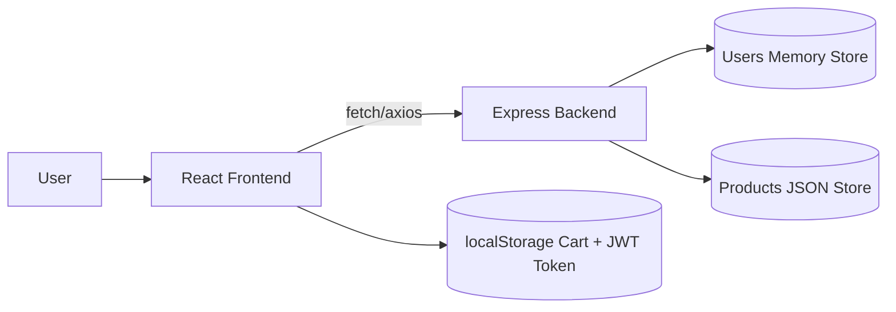

# NimbleCart – Mini E‑commerce (React + Express)

Fast to demo, easy to extend. Features:
- Product catalogue, detail pages, responsive grid
- Full‑text search across name/category/description
- Cart with quantity, total, and checkout stub (localStorage persistence)
- Auth (register/login) with JWT and protected `/api/me`
- Clean, modern UI (no external CSS frameworks required)
- Simple Express API with in‑memory data (swap in MongoDB later)

## Quickstart

### 1) API
```bash
cd ecom-backend
npm i
npm run dev
# API at http://localhost:4000
```

### 2) Frontend
```bash
cd ../ecom-frontend
npm i
npm run dev
# UI at http://localhost:5173 (Vite default)
# Set API URL if needed: echo "VITE_API_URL=http://localhost:4000" > .env
```

## Tech stack
- Frontend: React + React Router, Vite
- Backend: Node.js + Express, JWT auth
- Database: In‑memory for demo; swap to MongoDB Atlas by replacing the `users` array and `PRODUCTS` export.

## Project Structure
```
ecommerce-sample/
├── ecom-backend/
│   ├── package.json
│   ├── products.js
│   └── server.js
└── ecom-frontend/
    ├── index.html
    ├── package.json
    └── src/
        ├── App.jsx
        ├── api.js
        ├── main.jsx
        ├── styles.css
        ├── components/
        │   ├── Navbar.jsx
        │   └── ProductCard.jsx
        ├── context/
        │   ├── AuthContext.jsx
        │   └── CartContext.jsx
        └── pages/
            ├── Cart.jsx
            ├── Home.jsx
            ├── Login.jsx
            └── ProductDetails.jsx
```

## Architecture (High level)

```

### API Endpoints
- `POST /api/auth/register` → `{token, user}`
- `POST /api/auth/login` → `{token, user}`
- `GET  /api/me` (Bearer token) → `{user}`
- `GET  /api/products` → `{items}`
- `GET  /api/products/:id` → `{item}`
- `GET  /api/search?q=...` → `{items}`


